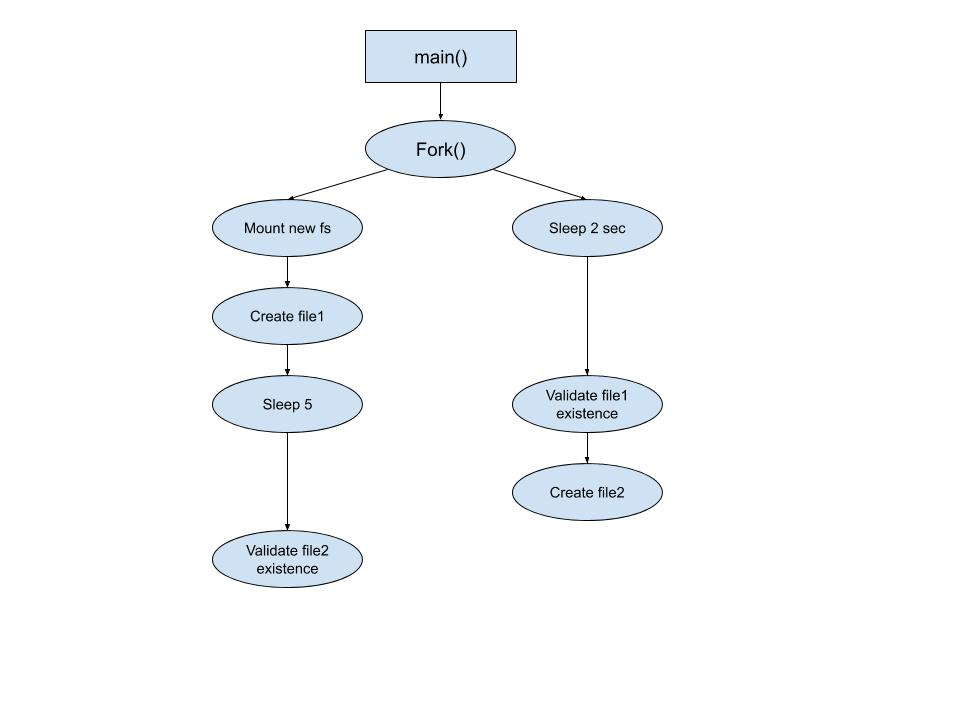
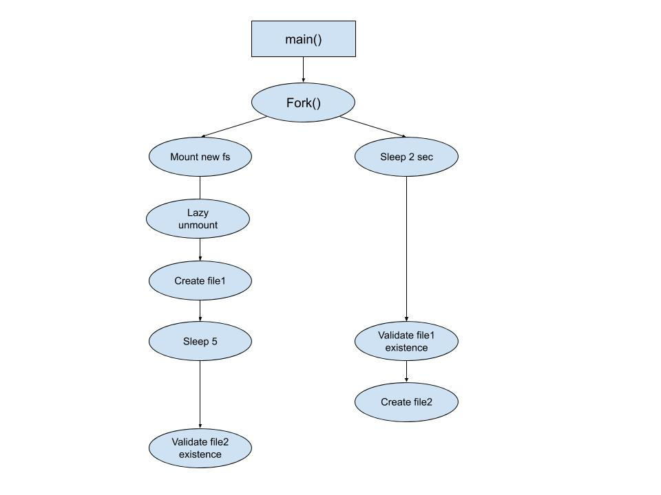

Learn Linux FS:
================
Linux fs intro
-------------------------------------------------
1. Read this high level overview from linux.com [1]_

2. Read IBM’s overview - basic fs mount & kernel-level implementation. [5]_

3. Read partitions and memory overview [6]_

   - Include exercises, try to answer by yourself.
  
4. Useful mounts maintain commands [8]_

   - Include exercises, try to answer by yourself.

   - Optional extra  [4]_
 
Different file systems
-------------------------------------------------

1. Read “Branching out with mount” section in [2]_

2. Read “Filesystem types” section in [2]_

   - The rest of [2]_ is optional (mostly partitions)

3. Optional more practical explanation [7]_

Mount and unmount
-------------------------------------------------
1. Read about mount and umount [9]_

   - Include exercises, try to answer by yourself.

2. Optional extra [3]_

Basic exercises
-------------------------------------------------
1. Run "mount" command and view all your current mounts. Analyze and describe three of them.   

2. Run "df" command and view your mounts. Analyze and describe three of them.
   
   - What flag should you add to view the sizes in readable format (i.e 1Kb instead of 1000b)?
   
3. Describe the difference between df and mount commands. What information each of them provides?

4. Generate new ext3 500Mb file system, and mount it as read only.

5. Run "mount" and "df", and copy the relevant lines.

6. Unmount your fs, validate that it has been removed using "mount" command.
 
Advanced programming in Unix 
-------------------------------------------------

1. Read section 4.14 in the book [13]_

2. Explain in your own words about the "unlink" function. Describe its potential effects.

3. Explain The difference between hard link and symbolic link in file system level.

Implement basic fs using FUSE 
-------------------------------------------------
1. Use FUSE [11]_ and implement your own file system.

Some code exercises 
-------------------------------------------------
1. Write a program that works as follow:

  ./your_program <MOUNT_PATH> <FS_TYPE> <PATH_TO_FILE>
  Mounts new fs of type <FS_TYPE> (enum value) and copies the given file into it.
  
  Your program should support the following file systems:

  - ext2

  - ext3

  - ext4

  - btrfs

2. Write a program that implement the following flow shown in mount_exercise1.jpg

Each validation should include relevant debug print.
Run your program, explain the output. 
   
3. Add lazy umount right after mounting, as shown in mount_exercise2.jpg
   Run your program, explain the output. 

Ramfs and Tmpfs
-------------------------------------------------

1. Read about ramfs [16]_

2. Read about tmpfs [17]_ [18]_

3. Difference from ramfs [14]_ [15]_

4. Bash exercises

   a) Mount a ramfs and a tmpfs file systems, specify size=10Mb.

   b) Try to create 6Mb file in both (using dd). Explain the results.

   c) Try to create another 6Mb file in both. Explain the results.

5. Add support for tmpfs to your program at `Some code exercises`_/1

Resources:
==================
.. [1] General intro - https://www.linux.com/training-tutorials/linux-filesystem-explained/ 

IBM developers 
-------------------------------------------------

lpic1 tutorial - https://developer.ibm.com/tutorials/l-lpic1-map/

Relevant sections: 

.. [2] Create partitions and filesystems - partitions management, different filesystems overview, mkfs - 

.. [3] Control mounting and unmounting of filesystems - 

.. [4] Maintain the integrity of filesystem - useful commands. 

.. [5] general filesystem ibm  - https://developer.ibm.com/tutorials/l-linux-filesystem/

LPI learning - includes exercises - lpic1
-------------------------------------------------

.. [6] hard disk -  https://learning.lpi.org/en/learning-materials/101-500/102/102.1/102.1_01/ 

.. [7] Create partitions and filesystems  - https://learning.lpi.org/en/learning-materials/101-500/104/104.1/104.1_01/ 

.. [8] maintain the integrity of file systems - https://learning.lpi.org/en/learning-materials/101-500/104/104.2/104.2_01/ 

.. [9] Mount and unmount - https://learning.lpi.org/en/learning-materials/101-500/104/104.3/104.3_01/ 

Snow B.V lipc2 
-------------------------------------------------

https://www.lpi.org/our-certifications/exam-201-objectives 
.. [10] Section 3 - file systems - http://lpic2.unix.nl/ 

Fuse
-------------------------------------------------

.. [11] Create own file system using fuse - https://maastaar.net/fuse/linux/filesystem/c/2016/05/21/writing-a-simple-filesystem-using-fuse/

.. [12] SSFS - an implementation example - https://github.com/MaaSTaaR/SSFS

Advanced programming in unix
------------------------------------

.. [13] PDF of the book - 

https://github.com/shihyu/Linux_Programming/blob/master/books/Advanced.Programming.in.the.UNIX.Environment.3rd.Edition.0321637739.pdf 

Ramfs and tmpfs - 
-------------------------------------------------

.. [14] https://www.jamescoyle.net/knowledge/951-the-difference-between-a-tmpfs-and-ramfs-ram-disk 

.. [15] https://www.thegeekstuff.com/2008/11/overview-of-ramfs-and-tmpfs-on-linux/ 

Ramfs

.. [16] kernel documentation https://www.kernel.org/doc/Documentation/filesystems/ramfs-rootfs-initramfs.txt

Tmpfs

.. [17] kernel documentation https://www.kernel.org/doc/Documentation/filesystems/tmpfs.txt 

.. [18] overview with examples - https://www.ibm.com/developerworks/library/l-fs3/index.html 

.. [19] Paper - http://wiki.deimos.fr/images/1/1e/Solaris_tmpfs.pdf 
